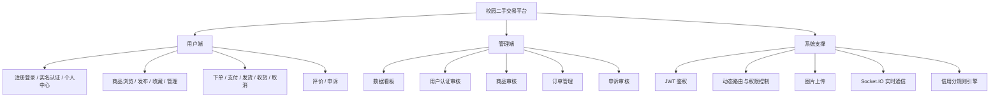

# 校园二手交易平台（Vue3）

一个面向校园场景的二手交易平台前端项目，覆盖用户端与管理端完整业务流程，包含商品交易、实名认证、订单申诉、信用分体系与后台审核治理能力。

## 项目介绍

本项目聚焦“发布-交易-售后-治理”全链路：

- 用户端：注册登录、实名认证、商品浏览/发布、下单支付、订单管理、评价、申诉。
- 管理端：数据看板、用户认证审核、商品审核、订单管理、申诉审核。
- 支撑能力：JWT 鉴权、动态路由、图片上传、实时通信、信用分规则。

## 技术栈

### 前端框架与工程化

- Vue 3
- TypeScript
- Vite
- Vue Router
- Pinia

### UI 与交互

- Element Plus
- @element-plus/icons-vue
- UnoCSS
- ECharts

### 网络与实时能力

- Axios
- Socket.IO Client

## 核心功能

- 账户体系：注册、登录、身份认证、个人信息维护（头像/昵称/手机号）。
- 商品体系：商品发布、分类筛选、详情展示、收藏、我发布的商品管理。
- 订单体系：创建订单、支付、发货、收货、取消订单、订单详情与状态流转。
- 评价与申诉：订单评价、卖家/买家申诉、管理员审核处理。
- 管理后台：看板统计、用户审核、商品审核、订单管理、申诉管理。
- 信用体系：基于交易与行为的信用分加减记录。

## 功能分支图



## 页面截图

> 当前仓库示例图位于 `src/assets/img`，可按需替换为实际页面截图（建议放在 `docs/screenshots`）。

### 首页运营图


### 活动海报图


### 认证示意图


## 项目结构

```text
vue-project
├─ src
│  ├─ api                # 接口封装
│  ├─ components         # 通用组件
│  ├─ layouts            # 布局（用户端/管理端）
│  ├─ router             # 路由与鉴权
│  ├─ stores             # Pinia 状态管理
│  ├─ utils              # 工具与请求封装
│  └─ views              # 页面（用户端 + 管理端）
├─ scripts               # 脚本（如测试数据生成）
├─ .env.development      # 开发环境配置
└─ .env.production       # 生产环境配置
```

## 环境要求

- Node.js：`^20.19.0` 或 `>=22.12.0`
- 包管理器：`pnpm`（推荐）

## 启动命令

### 1. 安装依赖

```bash
pnpm install
```

### 2. 本地开发启动

```bash
pnpm dev
```

默认会读取 `.env.development`，后端地址示例：

```env
VITE_API_BASE_URL='http://localhost:3000'
```

### 3. 类型检查

```bash
pnpm type-check
```

### 4. 打包构建

```bash
pnpm build
```

### 5. 本地预览构建产物

```bash
pnpm preview
```

### 6. 生成待审核商品测试数据（可选）

```bash
pnpm seed:products
```

可通过环境变量控制：

- `SEED_TOKEN`：登录 token（必填）
- `SEED_COUNT`：生成数量（默认 8）
- `SEED_API_BASE_URL`：接口地址（默认 `http://localhost:3000`）

## 开发建议

- 推荐 IDE：VS Code + Vue (Official)。
- 推荐浏览器插件：Vue Devtools。

## 许可证

仅用于学习与课程实践，商用请先确认授权与合规要求。
