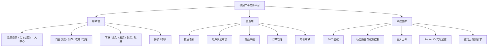
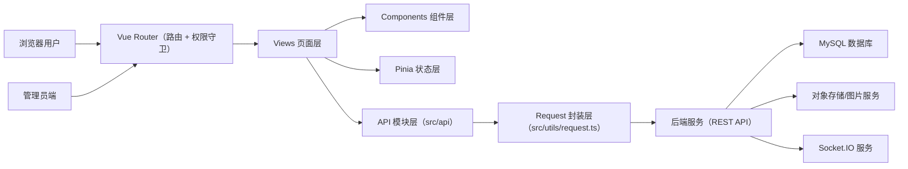

# 校园二手交易平台（Vue3）

一个面向校园场景的二手交易平台前端项目，覆盖用户端与管理端完整业务流程，包含商品交易、实名认证、订单申诉、信用分体系与后台审核治理能力。

## 项目介绍

本项目聚焦“发布-交易-售后-治理”全链路：

- 用户端：注册登录、实名认证、商品浏览/发布、下单支付、订单管理、评价、申诉。
- 管理端：数据看板、用户认证审核、商品审核、订单管理、申诉审核。
- 支撑能力：JWT 鉴权、动态路由、图片上传、实时通信、信用分规则。

## 技术栈

### 前端框架与工程化

- Vue 3
- TypeScript
- Vite
- Vue Router
- Pinia

### UI 与交互

- Element Plus
- @element-plus/icons-vue
- UnoCSS
- ECharts

### 网络与实时能力

- Axios
- Socket.IO Client

## 核心功能

- 账户体系：注册、登录、身份认证、个人信息维护（头像/昵称/手机号）。
- 商品体系：商品发布、分类筛选、详情展示、收藏、我发布的商品管理。
- 订单体系：创建订单、支付、发货、收货、取消订单、订单详情与状态流转。
- 评价与申诉：订单评价、卖家/买家申诉、管理员审核处理。
- 管理后台：看板统计、用户审核、商品审核、订单管理、申诉管理。
- 信用体系：基于交易与行为的信用分加减记录。

## 功能分支图



## 系统架构图



## 接口分层说明

### 分层结构

- 页面层（`src/views`）：负责页面展示、表单交互、状态触发。
- 组件层（`src/components`）：封装可复用 UI 和业务组件。
- 状态层（`src/stores`）：管理用户信息、认证状态、业务共享状态。
- 接口层（`src/api/*.ts`）：按业务域拆分接口（`auth/product/order/verify/admin`）。
- 请求层（`src/utils/request.ts`）：统一 Axios 实例、Token 注入、响应码处理、错误提示。

### 调用链路

```text
View/Component
   -> 调用 src/api 下的业务方法
   -> 经过 request.ts 拦截器（自动携带 Authorization）
   -> 请求后端接口
   -> 统一解析 { code, msg, data }
   -> 回写页面/Pinia 状态
```

### 典型接口模块

- `src/api/auth.ts`：登录注册、账号认证相关接口。
- `src/api/product.ts`：商品列表、详情、发布、上下架相关接口。
- `src/api/order.ts`：订单创建、状态流转、评价、申诉相关接口。
- `src/api/verify.ts`：实名认证提交、查询、管理员审核接口。
- `src/api/admin/*.ts`：后台用户、商品、订单、看板等管理接口。

## 页面截图

> 当前仓库示例图位于 `src/assets/img`，可按需替换为实际页面截图（建议放在 `docs/screenshots`）。

### 首页运营图


### 活动海报图


### 认证示意图


## 项目结构

```text
vue-project
├─ src
│  ├─ api                # 接口封装
│  ├─ components         # 通用组件
│  ├─ layouts            # 布局（用户端/管理端）
│  ├─ router             # 路由与鉴权
│  ├─ stores             # Pinia 状态管理
│  ├─ utils              # 工具与请求封装
│  └─ views              # 页面（用户端 + 管理端）
├─ scripts               # 脚本（如测试数据生成）
├─ .env.development      # 开发环境配置
└─ .env.production       # 生产环境配置
```

## 项目亮点与难点

### 项目亮点

- 完整业务闭环：覆盖“商品发布 -> 交易履约 -> 评价申诉 -> 后台治理”全链路。
- 双端统一：用户端与管理端共用一套工程体系，开发与维护成本更低。
- 可观测运营：管理看板集成核心统计，支持审核、申诉、订单管理协同处理。
- 交付质量可控：内置类型检查与构建流程，支持脚本化生成测试数据。

### 技术难点与处理方案

- 难点：订单/认证/申诉状态多，展示与操作容易错位。  
  方案：梳理状态机与按钮权限，按角色和状态进行显式分支判断。
- 难点：后端字段命名可能不一致（驼峰/下划线）。  
  方案：前端做统一字段兼容解析，关键统计项增加兜底逻辑。
- 难点：权限路由和动态路由易导致未认证用户跳转异常。  
  方案：增加前置守卫和失败回退策略，避免直接进入 404。
- 难点：审核与申诉流程涉及多角色协作，数据一致性要求高。  
  方案：在接口层统一错误处理，关键动作后主动刷新列表与详情。

## 环境要求

- Node.js：`^20.19.0` 或 `>=22.12.0`
- 包管理器：`pnpm`（推荐）

## 启动命令

### 1. 安装依赖

```bash
pnpm install
```

### 2. 本地开发启动

```bash
pnpm dev
```

默认会读取 `.env.development`，后端地址示例：

```env
VITE_API_BASE_URL='http://localhost:3000'
```

### 3. 类型检查

```bash
pnpm type-check
```

### 4. 打包构建

```bash
pnpm build
```

### 5. 本地预览构建产物

```bash
pnpm preview
```

### 6. 生成待审核商品测试数据（可选）

```bash
pnpm seed:products
```

可通过环境变量控制：

- `SEED_TOKEN`：登录 token（必填）
- `SEED_COUNT`：生成数量（默认 8）
- `SEED_API_BASE_URL`：接口地址（默认 `http://localhost:3000`）

## 部署步骤（生产环境）

### 1. 配置生产环境变量

编辑 `.env.production`：

```env
VITE_API_BASE_URL=http://你的后端地址:3000
API_TIMEOUT=5000
```

### 2. 安装依赖并构建

```bash
pnpm install
pnpm build
```

构建完成后会生成 `dist/` 静态资源目录。

### 3. 使用 Nginx 部署静态资源

将 `dist/` 上传到服务器，例如：`/var/www/vue-project/dist`。

Nginx 配置示例：

```nginx
server {
    listen 80;
    server_name your-domain.com;

    root /var/www/vue-project/dist;
    index index.html;

    location / {
        try_files $uri $uri/ /index.html;
    }
}
```

### 4. 重载 Nginx

```bash
nginx -t
nginx -s reload
```

### 5. 验证发布

- 访问首页与关键页面（商品列表、订单列表、管理后台）。
- 验证登录态、接口请求、路由刷新回退是否正常。
- 验证看板统计、审核流程、申诉流程是否可用。

## 常见部署问题排查

### 1. 路由刷新 404

现象：

- 在 `/admin/dashboard`、`/products/detail/:id` 等页面刷新后返回 404。

常见原因：

- 前端使用 History 路由模式，但 Nginx 未配置 SPA 回退。

解决方案：

- 确保 Nginx 配置包含 `try_files`，将未知路径回退到 `index.html`。

```nginx
location / {
    try_files $uri $uri/ /index.html;
}
```

### 2. 跨域（CORS）报错

现象：

- 浏览器控制台报 `CORS policy` 或 `No 'Access-Control-Allow-Origin'`。

常见原因：

- 前后端域名/端口不同，后端未正确开放 CORS。
- 预检请求 `OPTIONS` 未被后端或网关正确处理。

解决方案：

- 优先使用同域代理方案：前端请求 `/api`，由 Nginx 转发到后端。
- 或在后端显式配置允许来源、方法、Header 和凭证策略。

Nginx 反向代理示例：

```nginx
location /api/ {
    proxy_pass http://127.0.0.1:3000/;
    proxy_set_header Host $host;
    proxy_set_header X-Real-IP $remote_addr;
    proxy_set_header X-Forwarded-For $proxy_add_x_forwarded_for;
    proxy_set_header X-Forwarded-Proto $scheme;
}
```

同时建议前端环境变量统一为：

```env
VITE_API_BASE_URL=/api
```

### 3. 页面白屏

现象：

- 页面打开后空白，无明显 UI。

常见原因：

- 构建产物与部署路径不匹配，JS/CSS 资源 404。
- 部署了旧版本 `dist` 或浏览器强缓存导致资源不一致。
- 运行时异常（接口地址错误、脚本报错）导致应用未挂载。

排查步骤：

- 打开浏览器开发者工具，检查 Console 与 Network 首个报错。
- 检查 `index.html` 引用的 `assets/*.js` 是否 200。
- 本地执行 `pnpm build && pnpm preview` 验证构建产物是否正常。
- 清理 CDN/浏览器缓存后再访问。

### 4. 静态资源路径错误（图片/CSS/JS 404）

现象：

- 首页能打开，但样式丢失、图片不显示、控制台出现大量静态资源 404。

常见原因：

- 应用部署在二级路径（如 `/trade/`），但 Vite `base` 仍为默认 `/`。

解决方案：

- 若部署在根路径：`base: '/'`。
- 若部署在子路径：将 `vite.config.ts` 的 `base` 改为对应子路径。

示例（部署在 `/trade/`）：

```ts
// vite.config.ts
import { defineConfig } from 'vite'
import vue from '@vitejs/plugin-vue'

export default defineConfig({
  plugins: [vue()],
  base: '/trade/'
})
```

- Nginx 需与子路径一致，确保 `/trade/` 下静态文件可访问。

## 开发建议

- 推荐 IDE：VS Code + Vue (Official)。
- 推荐浏览器插件：Vue Devtools。

## 许可证

仅用于学习与课程实践，商用请先确认授权与合规要求。
