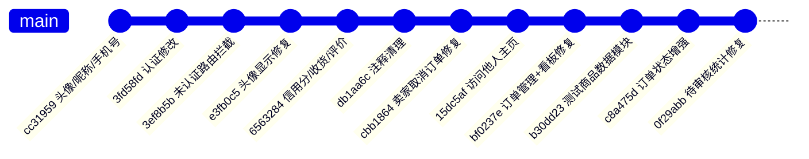
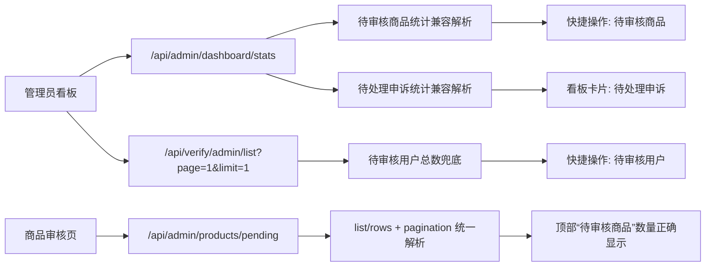

# 项目可视化总览

## 1) 功能分支图

```mermaid
flowchart TD
    Root["校园二手交易平台"]

    Root --> User["用户端"]
    Root --> Admin["管理端"]
    Root --> Support["系统支撑"]

    User --> UserAuth["账户与身份"]
    UserAuth --> Login["注册 / 登录"]
    UserAuth --> Verify["实名认证"]
    UserAuth --> Profile["个人中心"]
    Profile --> CreditDisplay["信用分展示"]

    User --> Home["首页与发现"]
    Home --> Recommend["推荐商品"]
    Home --> FAQ["FAQ 常见问题"]

    User --> Product["商品模块"]
    Product --> ProductList["商品列表 / 搜索 / 分类筛选"]
    Product --> ProductDetail["商品详情"]
    Product --> Favorite["商品收藏"]
    Product --> Publish["发布商品"]
    Product --> MyPublish["我发布的商品管理"]

    User --> Order["订单与交易"]
    Order --> CreateOrder["创建订单"]
    Order --> Pay["支付流程"]
    Order --> Ship["卖家发货"]
    Order --> Receive["买家确认收货"]
    Order --> Cancel["买家 / 卖家取消订单"]
    Order --> Appeal["申诉流程"]
    Order --> Review["订单评价"]

    Admin --> Dashboard["数据看板"]
    Admin --> AdminUser["用户管理 / 认证审核"]
    Admin --> AdminProduct["商品审核"]
    Admin --> AdminOrder["订单管理"]
    Admin --> AdminAppeal["申诉审核"]

    Support --> AuthSupport["JWT 鉴权"]
    Support --> RouteSupport["动态路由 + 权限控制"]
    Support --> Upload["图片上传"]
    Support --> Socket["实时通信"]
    Support --> Database["MySQL 数据存储"]
```

## 2) 近期变动时间线（最近 12 次提交）

```mermaid
gitGraph
   commit id: "cc31959 头像/昵称/手机号"
   commit id: "3fd58fd 认证修改"
   commit id: "3ef8b5b 未认证路由拦截"
   commit id: "e3fb0c5 头像显示修复"
   commit id: "6563284 信用分/收货/评价"
   commit id: "db1aa6c 注释清理"
   commit id: "cbb1864 卖家取消订单修复"
   commit id: "15dc5af 访问他人主页"
   commit id: "bf0237e 订单管理+看板修复"
   commit id: "b30dd23 测试商品数据模块"
   commit id: "c8a475d 订单状态增强"
   commit id: "0f29abb 待审核统计修复"
```

## 3) 最新问题修复影响图（待审核统计）

```mermaid
flowchart LR
    A["管理员看板"] --> B["/api/admin/dashboard/stats"]
    A --> C["/api/verify/admin/list?page=1&limit=1"]
    B --> D["待审核商品统计兼容解析"]
    B --> E["待处理申诉统计兼容解析"]
    C --> F["待审核用户总数兜底"]
    D --> G["快捷操作: 待审核商品"]
    E --> H["看板卡片: 待处理申诉"]
    F --> I["快捷操作: 待审核用户"]

    J["商品审核页"] --> K["/api/admin/products/pending"]
    K --> L["list/rows + pagination 统一解析"]
    L --> M["顶部“待审核商品”数量正确显示"]
```

## 4) 本次涉及文件

- `src/views/admin/product/review.vue`
- `src/views/admin/dashboard/index.vue`
- `project-visual-map.md`
